# InsureIntel Zimbabwe — System Architecture & Modular Dependencies Audit
**Document Date:** May 28, 2026  
**Audited Directory:** `app/`  

---

## 1. Full Module Dependency Map

The application is structured around a central core layer, a data model layer, and modular business domains grouped under `app/modules/`. External infrastructure (scrapers, scheduler, dataset registry) is located under `app/infrastructure/`. Machine learning and information retrieval engines are under `app/ai/` and `app/ml/`.

```mermaid
graph TD
    %% Core & Configuration
    subgraph Core ["Core Layers"]
        Config["app.core.config"]
        DB["app.core.db"]
        Logging["app.core.logging"]
    end

    %% Infrastructure
    subgraph Infrastructure ["Infrastructure & Scrapers"]
        Scheduler["app.infrastructure.scrapers.scraper_scheduler"]
        BaseScraper["app.infrastructure.scrapers.base_scraper"]
        IPECScraper["app.infrastructure.scrapers.ipec_scraper"]
        NewsScraper["app.infrastructure.scrapers.news_scraper"]
        DatasetRegistry["app.infrastructure.storage.dataset_registry"]
    end

    %% AI & ML Engines
    subgraph AI ["AI & ML Engines"]
        NERPipeline["app.ai.nlp.ner_pipeline"]
        STModel["_get_st_model (sentence-transformers)"]
        VectorStore["app.ai.rag.vector_store"]
        QAEngine["app.ai.rag.qa_engine"]
        IndexingPipeline["app.ai.rag.indexing_pipeline"]
        XGBoostModel["app.ai.inference.csp_xgboost_model"]
        WCSScorer["app.ai.inference.csp_wcs_scorer"]
        NLG["app.ai.inference.csp_nlg"]
    end

    %% Main Application Domains
    subgraph Modules ["Domain Modules (app.modules.*)"]
        Auth["auth"]
        Docs["documents"]
        Insurers["insurers"]
        Financials["financials"]
        Intel["intel"]
        Feedback["feedback"]
        Deviation["deviation"]
        Comparison["comparison"]
        Compliance["compliance"]
        CSP["csp"]
        QA["qa"]
        Tracker["tracker"]
        Audit["audit"]
        Reports["reports"]
        Chatbot["chatbot"]
    end

    %% Router Layer
    Main["app.main (FastAPI Application)"]
    UIRouter["app.ui.router"]
    CompatRouter["app.modules.compat_router"]

    %% Dependencies (Static and Runtime)
    Main --> Modules
    Main --> UIRouter
    Main --> CompatRouter
    Main --> Config
    Main --> DB

    %% Cross-Module Dependency Rules
    Docs --> Compliance
    Docs --> NERPipeline
    Intel --> Insurers
    Intel --> Financials
    Intel --> XGBoostModel
    Intel --> NLG
    Comparison --> VectorStore
    Comparison --> STModel
    Deviation --> Comparison
    Deviation --> VectorStore
    Deviation --> STModel
    Feedback --> Docs
    Feedback --> FeedbackStore["feedback_store"]
    Tracker --> Docs
    Tracker --> Scheduler
    QA --> QAEngine
    QA --> IndexingPipeline
    IndexingPipeline --> VectorStore
    
    %% Scraper Dependencies
    IPECScraper --> BaseScraper
    NewsScraper --> BaseScraper
    Scheduler --> DB
    Scheduler --> IPECScraper
    Scheduler --> NewsScraper
    
    classDef core fill:#f9f,stroke:#333,stroke-width:2px;
    classDef ai fill:#bbf,stroke:#333,stroke-width:2px;
    classDef module fill:#bfb,stroke:#333,stroke-width:2px;
    classDef infra fill:#fdb,stroke:#333,stroke-width:2px;
    
    class Config,DB,Logging core;
    class NERPipeline,STModel,VectorStore,QAEngine,IndexingPipeline,XGBoostModel,WCSScorer,NLG ai;
    class Auth,Docs,Insurers,Financials,Intel,Feedback,Deviation,Comparison,Compliance,CSP,QA,Tracker,Audit,Reports,Chatbot module;
    class Scheduler,BaseScraper,IPECScraper,NewsScraper,DatasetRegistry infra;
```



---

## 2. Service Relationships

The application runs a clean, layered service design in most modules, where the API router handles the HTTP layer, delegates processing to a module-specific service class, which in turn queries databases through repositories (`repo.py`) or SQLite models.

### Primary Service Call Flows
1. **Advisory Service Flow**:
   - `advisory_page` (UI Router) $\to$ `generate_advisory` (in `app/modules/intel/advisory_service.py`) $\to$ calls `claims_sentiment` and `financial_metrics` $\to$ computes `fused_risk` (in `app/modules/scoring/fusion.py`) $\to$ triggers `insurer_predictor` (in `app/modules/ml/insurer_predictor.py`) to rank suitable insurers.
2. **Document Processing Flow**:
   - `upload_document` (API/UI Router) $\to$ `create_document_from_upload` (in `app/modules/documents/service.py`) $\to$ saves physical PDF $\to$ calls `process_document_full` $\to$ triggers `pdf_extractor` $\to$ triggers `DocumentClassifierService` $\to$ triggers `EntityExtractionService` (spaCy) $\to$ triggers `ComplianceChecker.check_compliance` $\to$ commits records to SQLite `app.db`.
3. **Settlement Power Flow**:
   - `score_insurer` (in `app/modules/csp/service.py`) $\to$ calls `WCSScorer.score` (weighted composite score formula) $\to$ calls `CSPXGBoostModel.predict_risk` (ML anomaly detection) $\to$ calls `CSPNaturalLanguageGenerator.generate` (generates broker recommendation paragraphs) $\to$ commits to `csp_scores` table.

### Database Transaction Boundaries
* Database sessions (`SessionLocal`) are managed per-request using FastAPI's dependency injection (`Depends(get_db)`).
* Service boundaries generally do not create nested transactions. However, background batch processors (`app/batch/tasks.py`) and scraper runs manage their own database sessions manually, committing or rolling back transaction blocks individually inside processing loops.

---

## 3. Circular Dependencies

Standard module-level circular imports are statically checked and mitigated. However, to prevent `ImportError` on startup, the developers bypassed import limits by employing **function-local imports (lazy imports)**. 

These represent hidden coupling paths that technically make the dependency graph cyclic at runtime:

| Source Module | Target Module | Function / Context | Line | Reason / Runtime Cycle |
| :--- | :--- | :--- | :--- | :--- |
| `app.modules.compat_router` | `app.modules.compliance.service` | `_run_compliance_check` | 39 | Router relies on specific service singletons. |
| `app.modules.compat_router` | `app.modules.deviation.clause_scorer` | `compat_analysis_ml` | 186 | Router bypasses modules-level routers to run ML deviations directly. |
| `app.modules.compat_router` | `app.ai.rag.qa_engine` | `compat_knowledge_base_ask` | 221 | Router exposes direct RAG queries on legacy endpoints. |
| `app.modules.compat_router` | `app.modules.comparison.service` | `compat_documents_compare` | 255 | Bypasses comparison module router. |
| `app.modules.feedback.retraining_pipeline` | `app.modules.circulars.model` | `prepare_ner_training_data` | 52 | Feedback loop pulls training datasets from disabled circulars. |
| `app.modules.insurers.router` | `app.infrastructure.scrapers.scraper_scheduler` | `_run` | 257 | Dynamic trigger of scraper tasks from insurer administration panel. |
| `app.modules.intel.advisory_service` | `app.modules.insurers.analytics_service` | `generate_advisory` | 310 | Circular path where advisory depends on analytical scores of insurers. |
| `app.modules.intel.settlement_router` | `app.modules.csp.service` | `_score_insurer` | 121 | Intel settlement router directly scores insurers using WCS service. |
| `app.modules.ml.forecaster` | `app.modules.insurers.repo` | `train` | 125 | Forecasting ML models rely on insurer repositories for target metrics. |
| `app.modules.scoring.fusion` | `app.modules.circulars.model` | `compute_fused_risk` | 176 | Core risk fusion scoring checks rules in the legacy circulars tables. |
| `app.modules.tracker.service` | `app.modules.circulars.model` | `sync_from_document` | 47 | Policy tracker attempts to sync policy alerts from legacy circular schemas. |
| `app.ui.router` | `app.modules.intel.repo` | `alerts_ui_page` | 773 | UI template directly fetches raw articles from repository bypass. |

---

## 4. Duplicate Logic Regions

We identified several regions where code snippets and processing algorithms are duplicated across separate modules instead of using shared utilities:

1. **Clause Classification Heuristic (`_classify_clause_type`)**:
   - Location 1: `app/modules/comparison/service.py` (Lines 150-163)
   - Location 2: `app/modules/deviation/knowledge_base_seeder.py` (Lines 329-343)
   - *Logic:* Checks strings against identical lists of keywords (e.g., "exclusion", "not covered", "cancellation", "claim procedure") to categorize clauses into General, Exclusion, Coverage, Cancellation, or Claims.
2. **Text Cleaning & Keyword Extraction (`_extract_keywords`)**:
   - Location 1: `app/ai/rag/qa_engine.py` (Lines 178-181)
   - Location 2: `app/modules/chatbot/router.py` (Lines 434-437)
   - *Logic:* Tokenizes questions using regex `\b[a-zA-Z]{3,}\b` and filters out stop words.
3. **Stop Word Definitions (`_STOP_WORDS`)**:
   - Location 1: `app/ai/rag/qa_engine.py` (Lines 28-35)
   - Location 2: `app/modules/chatbot/router.py` (Lines 403-410)
   - *Logic:* Hardcoded set of 30+ lowercase English pronouns, prepositions, and chatbot indicators.
4. **Sentence Scoring logic for Q&A search**:
   - Location 1: `app/ai/rag/qa_engine.py` (`_score_sentences` Lines 183-206)
   - Location 2: `app/modules/chatbot/router.py` (`_search_document_text` Lines 440-471)
   - *Logic:* Sentence splitter regex `(?<=[.!?])\s+` splits raw text, loops over sentences, counts keyword overlap, adds a length-based normalizer, and sorts candidates descending.

---

## 5. Unsafe Coupling (Layer Violations)

1. **UI Making Internal HTTP Requests back to itself**:
   - Inside `app/ui/router.py` and `app/ui/extra_router.py`, several HTML endpoints make asynchronous HTTP requests to `settings.api_base` (their own application) using `httpx.AsyncClient()`.
   - *Example:* `/documents-ui/{document_id}` calls `client.get(f"/api/documents/{document_id}")` over the loopback network interface.
   - *Implication:* Spawning secondary loopback HTTP calls inside a FastAPI app consumes worker connections, spikes latency, and complicates authorization (since the UI must extract the cookie and format it as a `Bearer` token inside the HTTP client). It represents a structural anti-pattern for a unified monolithic deployment.
2. **Bypassing Service Layer for Direct DB / Repository Operations**:
   - While some UI views call the API over HTTP, others directly import repositories or core database engines (e.g. `from app.core.db import SessionLocal`, `from app.modules.insurers.repo import InsurerRepo`).
   - This leads to a mixed, inconsistent design:
     $$\text{UI Router} \xrightarrow{\text{HTTP}} \text{API Router} \xrightarrow{\text{Direct}} \text{Service} \to \text{DB}$$
     $$\text{UI Router} \xrightarrow{\text{Direct Import}} \text{Repository} \to \text{DB}$$
3. **Bypassing Vector Store Interface for Sentence Transformer Models**:
   - Both `app/modules/deviation/clause_scorer.py` and `app/modules/comparison/clause_aligner.py` bypass standard interfaces and import the private module-level loader `_get_st_model` directly from `app.ai.rag.vector_store`. They call `model.encode(...)` inside their own code rather than requesting embeddings via an abstracted NLP/Embedding service interface.

---

## 6. Dead Modules (Orphaned / Unused Files)

1. **Unregistered Domain Modules**:
   - **`app/modules/circulars/`**: Fully functional circulars scraping and classification module. However, the comments in `app/main.py` explicitly state it has been removed from live application routing and is kept on disk solely for training data pipelines.
   - **`app/modules/zse/`**: Fully functional scraper for the Zimbabwe Stock Exchange. Removed from live registration because the scraping logic proved too fragile for the production environment.
2. **Vector Database Retrieval (`chromadb` query pathway)**:
   - **`VectorStore.query`** (in `app/ai/rag/vector_store.py` lines 186-233): This method embeds questions using SentenceTransformers and queries ChromaDB collections for semantic context.
   - *Audit Finding:* This method is **never called anywhere in the codebase**. The actual conversational Q&A system (`app/modules/qa/router.py`) and floating chatbot (`app/modules/chatbot/router.py`) completely bypass ChromaDB and execute an offline keyword-matching sentence scorer over raw text stored in SQLite.

---

## 7. Router Hierarchy

FastAPI includes a unified routing tree registered in `app/main.py`. The routing hierarchy is mapped below:

```
FastAPI (app)
 ├── Static Files: /static (mounted to app/ui/static)
 ├── UI HTML Routes (Jinja2 Templates)
 │    ├── app.ui.router (UI Login, Registration, Document Detail, Financials, etc.)
 │    └── app.ui.extra_router (Category Landing Pages, Client Profile, Kanban Renewals, System Setup)
 ├── Public API Routes
 │    └── app.modules.auth.router (/auth/login, /auth/register, /auth/user)
 └── Protected API Routes (Requires JWT Cookie/Header)
      ├── /api/documents (app.modules.documents.router - Upload, Fetch, Archive, Delete)
      ├── /insurers (app.modules.insurers.router - Insurer CRUD, Solvency, Claims CSV Import)
      ├── /financials (app.modules.financials.router - FSR-1 Return Snapshots)
      ├── /api/news (app.modules.news.router - Scraped article feed, Sentiment logs)
      ├── /ml (app.modules.ml.router - Forecast, Explain, Train classifiers)
      ├── /api/routes/csp_routes (app.api.routes.csp_routes - Score list/refresh)
      ├── /intel (app.modules.intel.router - Advisory triggers, GDELT scrapers)
      ├── /intel/settlement (app.modules.intel.settlement_router - Settlement lookup)
      ├── /api/qa (app.modules.qa.router - Document Q&A asks, manual Vector Indexing)
      ├── /api/comparison (app.modules.comparison.router - Document compare & diff)
      ├── /api/feedback (app.modules.feedback.router - Feedback submit, Model retrain)
      ├── /api/deviation (app.modules.deviation.router - Standards seeding, Deviation scores)
      ├── /api/batch (app.modules.batch.router - Portfolio run task scheduler)
      ├── /api/tracker (app.modules.tracker.router - Policy management tracker)
      ├── /api/audit (app.modules.audit.router - System audit logs)
      ├── /api/multilingual (app.modules.multilingual.router - Shona-English detector/translator)
      ├── /clients (app.modules.clients.router - Client CRUD operations)
      ├── /api/reports (app.modules.reports.router - Executive PDF report generator)
      ├── /api/chatbot (app.modules.chatbot.router - FAB floating chatbot queries)
      └── compat (app.modules.compat_router - Compatibility wrappers for old REST paths)
```

---

## 8. Data Flow Map

The following map highlights the step-by-step path of an incoming client request down to the persistence layer:

```
[Client Browser]
       │
       ▼
 1. [HTTP Request] ──────────────────────────► (e.g. POST /api/qa/ask)
       │
       ▼
 2. [FastAPI Middlewares]
       │  ├─ app.modules.audit.audit_middleware (Logs metadata to audit_logs table)
       │  └─ CORS / Session State checkers
       ▼
 3. [Router Layer]
       │  └─ Depends(get_current_user) (Validates JWT tokens from Cookies or Headers)
       ▼
 4. [Service Layer] ─────────────────────────► QAEngine.answer()
       │                                           │
       │                                           ▼
       │                                       5. [_extract_keywords()]
       │                                           │
       │                                           ▼
       │                                       6. [_score_sentences()]
       │                                           │
       │                                           ▼
       ▼                                     [Finds matches in text]
 7. [Repository / Model Layer]
       │  └─ SessionLocal (SQLAlchemy queries sqlite:///./app.db)
       ▼
 8. [Database Engine (SQLite)] ──────────────► Inserts new QASession row
```

---

## 9. File Upload & Processing Lifecycle Map

The processing of an insurance document goes through several sequential stages:

```
[User Selects File] ──► Drag & Drop / Vault Picker (UI)
                              │
                              ▼
[HTTP Multipart POST] ──► /api/documents/upload
                              │
                              ▼
[Physical Write] ───────► Saves file to disk under `storage/documents/`
                              │
                              ▼
[Metadata Persisted] ───► Inserts row to `documents` table (status = "uploaded")
                              │
                              ▼
[Text Extraction] ──────► `pdf_extractor` extracts text. If chars < 50, status = "extraction_failed".
                              │
                              ▼
[Document Classifier] ──► Logistic Regression categorizes document (e.g., Policy Wording, Reinsurance)
                              │
                              ▼
[NER Extraction Pass] ──► spaCy model + Regex extracts 8 Entity types (MONEY, DATE, ORG, etc.)
                              │
                              ▼
[Compliance Engine] ────► Checks clauses against Zimbabwe Insurance Act and sandbox guidelines
                              │
                              ▼
[RAG Indexing] ─────────► (Manual / Batch) Chunks text, runs SentenceTransformers, stores in ChromaDB
                              │
                              ▼
[Complete] ─────────────► Sets document status = "processed"
```

---

## 10. AI/RAG Lifecycle Map

### 1. Document Q&A Loop (`/api/qa/ask`)
This pipeline provides domain-specific answers for single policy documents:

```
[User Ask Request] ────► question + document_id
                               │
                               ▼
[DB Query] ────────────► Retrieves document `extracted_text` from app.db
                               │
                               ▼
[QAEngine NLP Pass] ───► Tokenizes question, extracts keywords, filters stop words
                               │
                               ▼
[Sentence Scoring] ────► Splits text into sentences, scores based on keyword occurrences
                               │
                               ▼
[Select Top 3] ────────► Merges top 3 sentences, tags source indices (e.g., "Sentence 12")
                               │
                               ▼
[Persist Session] ─────► Saves question, answer, citations, and confidence in `qa_sessions`
```

### 2. Floating Master Chatbot Loop (`/api/chatbot/message`)
Uses a cascading intent tree to resolve user requests offline:

```
                     [User Message Received]
                                │
                                ▼
                     {Is document_id passed?}
                               / \
                             YES  NO
                             /     \
                            ▼       ▼
               [Get doc text from DB]   [Intent regex matching]
                            │                     │
                            ▼                     ▼
               [Keyword sentence search]   {Does intent match _KB?}
                            │                     / \
                            ▼                   YES  NO
                     {Matches found?}           /     \
                           / \                 ▼       ▼
                         YES  NO       [Return KB]  [Informative Fallback]
                         /     \
                        ▼       ▼
            [Return Document]  [Intent regex matching]
```

### 3. Active Learning & Feedback Loop
To refine the NLP performance, the application implements a retraining cycle:
1. **Entity Corrections:** Brokers submit corrections for incorrect entities (type/value) via `submit_entity_feedback`.
2. **Persistence:** Feedback is written to `extracted_entities` and `feedback_logs` database tables.
3. **Trigger:** The retraining pipeline is executed dynamically (`POST /api/feedback/retrain`) or as a scheduled scraper process.
4. **Data Generation:** Corrected spans are loaded, consolidated, formatted, and written out to spaCy training formats.
5. **Execution:** Fine-tunes spaCy NLP models and saves them to `storage/models/app/ner_model`, updating the live extraction pipeline.
